# Employee Management System

A full-stack HR management platform built with Spring Boot and React.js. Handles employee records, attendance, leaves, projects, and promotions — with separate experiences for Admins and Employees.

**Backend repo** — you're here &nbsp;|&nbsp; **Frontend** — [employee-management-frontend](https://github.com/iammob64/employee-management-frontend)

🔗 **Live Demo** — [employee-management-frontend-tawny.vercel.app](https://employee-management-frontend-tawny.vercel.app/)

> ⚠️ Backend runs on Render's free tier — first load may take ~30 seconds to wake up.

---

## Role-Based Access

The app has two roles — **Admin** and **Employee**. What you see changes completely depending on which one you log in as.

| Feature | Admin | Employee |
|---|---|---|
| Manage Employees (add/edit/delete) | ✅ | ❌ |
| View Departments | ✅ | ❌ |
| Attendance — full team view | ✅ | ❌ |
| Attendance — mark own | ✅ | ✅ |
| Leave Management (approve/reject) | ✅ | ✅ (apply only) |
| Projects | ✅ | ✅ (view only) |
| Promotions | ✅ | ✅ (view own) |

---

## Security Features

- Role-based access control — Admin and Employee roles with completely separate sidebar and route access
- Password strength enforcement on registration (length, uppercase, lowercase, number, special character)
- Auth context persisted across page navigation via React Context API
- Duplicate email rejection at service layer
- Input validation on all API endpoints via Spring's `@Valid` + `@NotBlank` / `@Email`

---

## Screenshots

### Landing Page
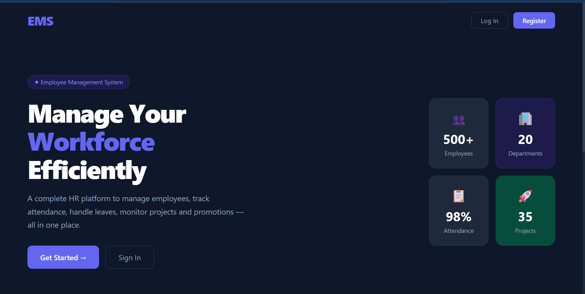

---

### Registration
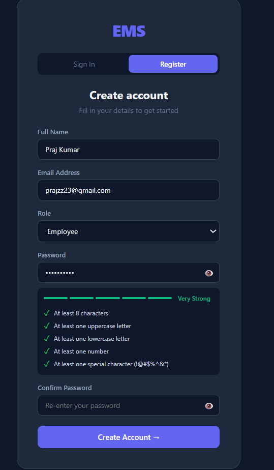

Password validation enforces minimum 8 characters, uppercase, lowercase, number, and special character — with a live strength indicator.

---

### Admin — Dashboard
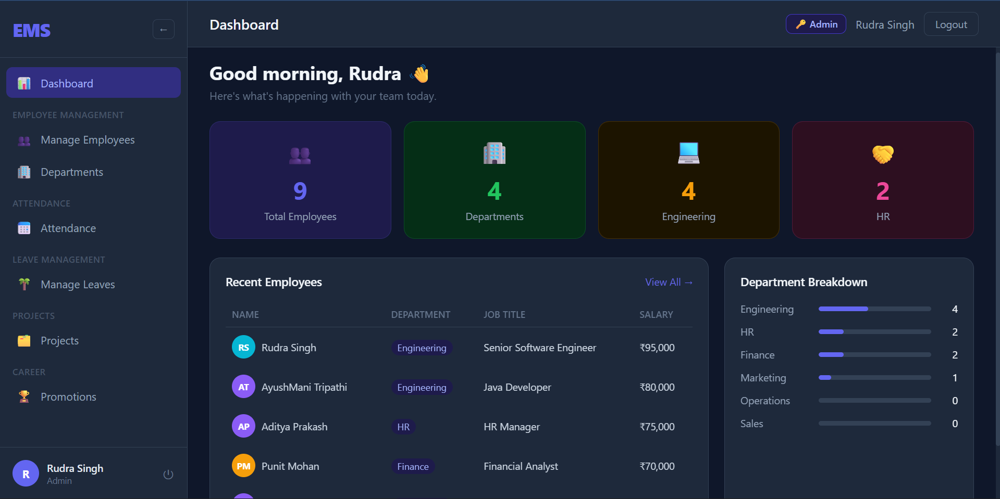

Stats overview with total employees, department breakdown, recent employees list, and department-wise progress bars.

---

### Admin — Manage Employees
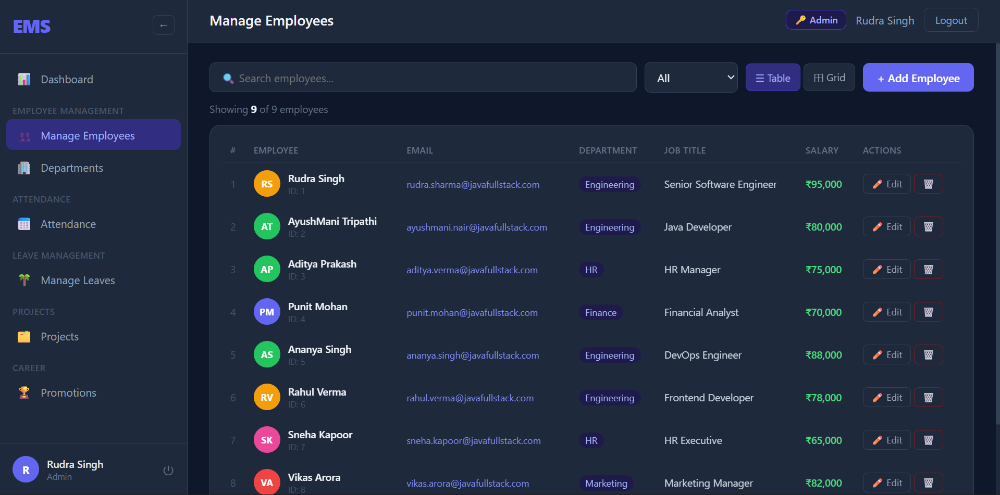

Search by name, filter by department, toggle between table and grid view. Full add/edit/delete access.

---

### Admin — Departments
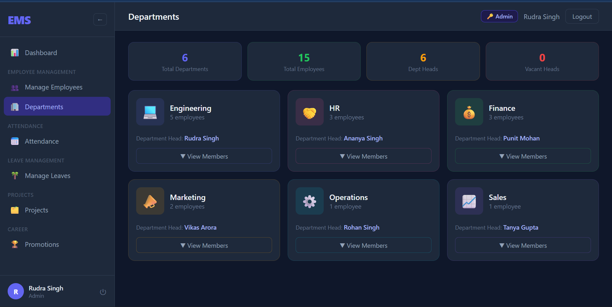

Department cards with head, member count, and a View Members toggle.

---

### Admin — Attendance
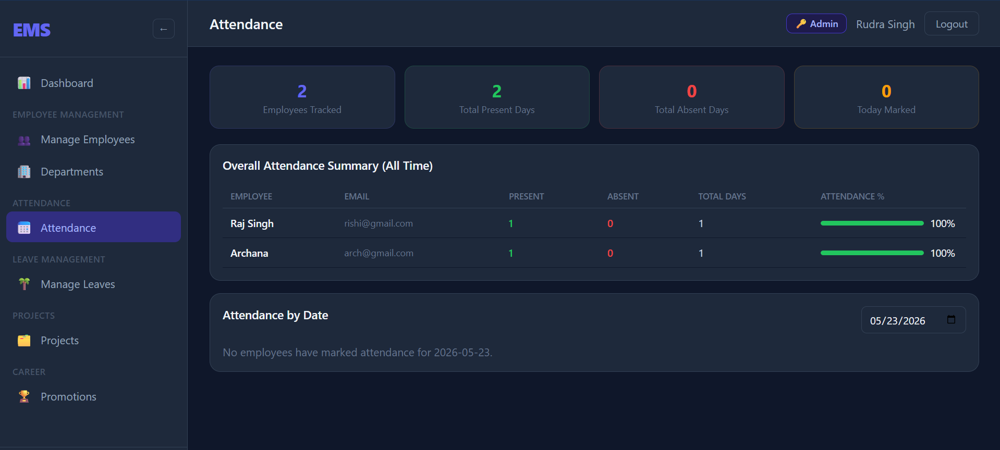

Full team attendance summary — present/absent counts per employee, attendance percentage, and a date filter for daily records.

---

### Admin — Manage Leaves
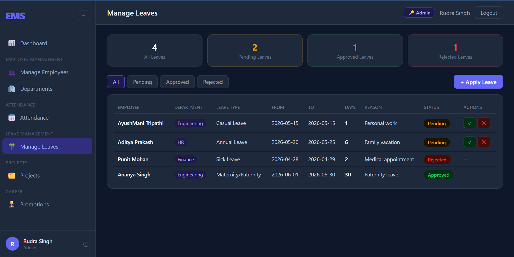

Approve or reject leave requests. Filterable by All / Pending / Approved / Rejected.

---

### Admin — Projects
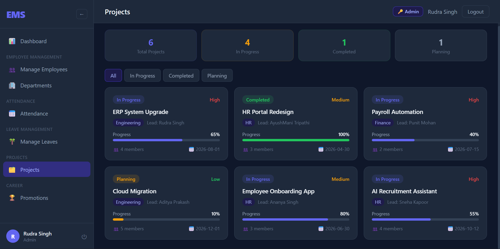

Track active projects across departments with progress bars, priority labels, team size, and deadlines.

---

### Admin — Promotions
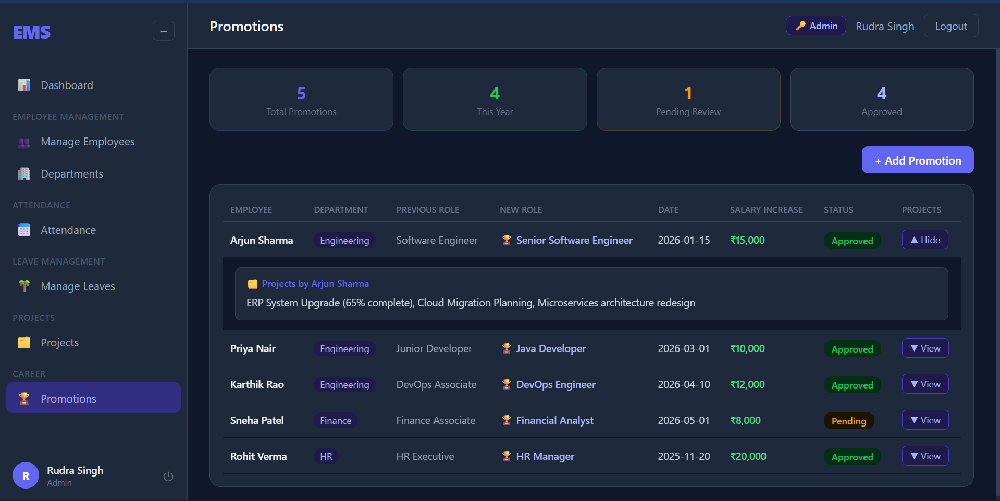

Promotion history with previous role, new role, salary increase, and approval status. Expandable project contributions per employee.

---

### Employee — Dashboard
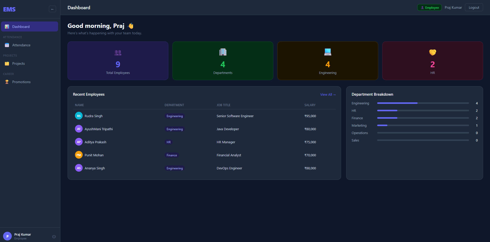

Employees get a restricted sidebar — only Attendance, Projects, and Promotions are visible.

---

### Employee — Attendance
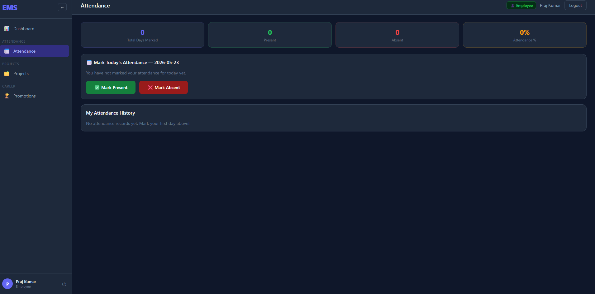

Employees mark their own attendance daily (Present / Absent) and can view their personal history.

---

## Tech Stack

**Backend**
- Java 17, Spring Boot 3.2
- Spring Data JPA + Hibernate
- H2 in-memory database
- Bean Validation (`@Valid`, `@NotBlank`, `@Email`)
- Maven, Docker

**Frontend**
- React.js
- Context API (auth + role state)
- Axios

**Deployment**
- Backend → Render
- Frontend → Vercel

---

## Project Structure

```
src/main/java/com/javafullstack/employee/
├── controller/
│   ├── EmployeeController.java
│   ├── AttendanceController.java
│   └── PromotionController.java
├── service/
│   ├── EmployeeService.java
│   ├── AttendanceService.java
│   └── PromotionService.java
├── repository/
│   ├── EmployeeRepository.java
│   ├── AttendanceRepository.java
│   └── PromotionRepository.java
├── model/
│   ├── Employee.java
│   ├── Attendance.java
│   └── Promotion.java
├── config/
│   └── CorsConfig.java
└── EmployeeApplication.java
```

---

## API Endpoints

### Employees `/api/employees`
| Method | Endpoint | Description |
|--------|----------|-------------|
| GET | `/api/employees` | Get all |
| GET | `/api/employees/{id}` | Get one |
| POST | `/api/employees` | Create |
| PUT | `/api/employees/{id}` | Update |
| DELETE | `/api/employees/{id}` | Delete |
| GET | `/api/employees/search?keyword=` | Search by name |
| GET | `/api/employees/department/{dept}` | Filter by department |

### Attendance `/api/attendance`
| Method | Endpoint | Description |
|--------|----------|-------------|
| POST | `/api/attendance` | Mark attendance |
| GET | `/api/attendance` | All records (admin) |
| GET | `/api/attendance/employee/{email}` | By employee |
| GET | `/api/attendance/today/{email}` | Today's record |
| GET | `/api/attendance/date/{date}` | By date |

### Promotions `/api/promotions`
| Method | Endpoint | Description |
|--------|----------|-------------|
| GET | `/api/promotions` | All |
| POST | `/api/promotions` | Create |
| GET | `/api/promotions/employee/{name}` | By employee |
| GET | `/api/promotions/status/{status}` | By status |
| PATCH | `/api/promotions/{id}/status` | Update status |

---

## Running Locally

```bash
git clone https://github.com/iammob64/employee-management-backend.git
cd employee-management-backend
./mvnw spring-boot:run
```

Backend runs at `http://localhost:8080`  
H2 console at `http://localhost:8080/h2-console`

**With Docker:**
```bash
docker build -t employee-management-backend .
docker run -p 8080:8080 employee-management-backend
```

**Frontend:**
```bash
git clone https://github.com/iammob64/employee-management-frontend.git
cd employee-management-frontend
npm install
npm start
```

Frontend at `http://localhost:3000`

---

## Notes

- H2 is in-memory — data resets on restart. Replace with MySQL for production use
- Partial updates on PUT — only fields sent in the request body get updated
- Duplicate email addresses are blocked at the service layer before hitting the database
